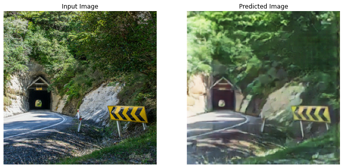
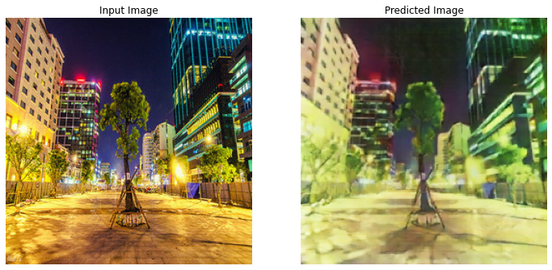
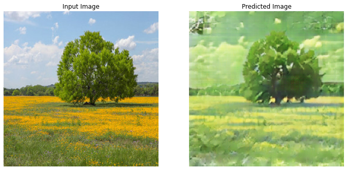
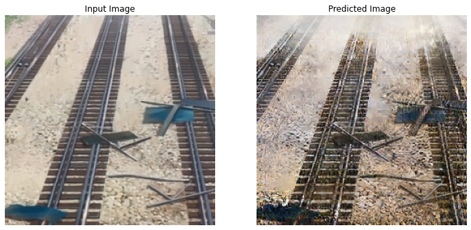
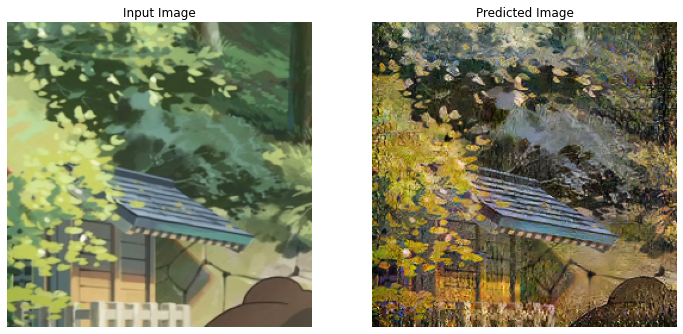
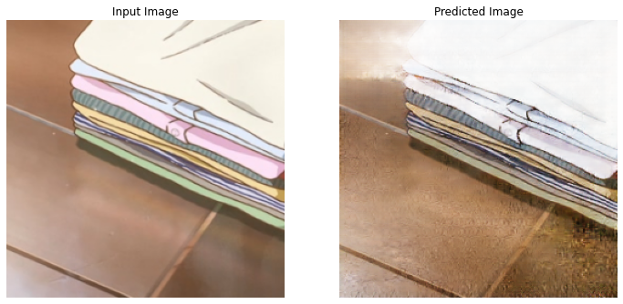

# Photo2Anime (& Anime2Photo) CycleGAN

Utilising Tensorflow implementation of [Unpaired Image-to-Image Translation using Cycle-Consistent Adversarial Networks](https://arxiv.org/abs/1703.10593).

## Purpose

Anime is commonly portrayed in real cities, where backgrounds are painstakingly copied and re-drawn/animated into the anime art style. By utilising modern techniques it has become achievable to automate this process using Generative Advesarial Networks (GAN).

## Results

### (1) Photo2Anime

### (2) Anime2Photo

## Code

Code is Tensorflow implementation of CycleGAN, found in `src/`

## Datasets

* Photo dataset from Tensorflow monet2photo (drop monet).
* Anime dataset curated by [TachibanaYoshino](https://github.com/TachibanaYoshino/AnimeGANv2/releases/download/1.0/Shinkai.tar.gz), 1445 frames from Makoto Shinkai's Your Name (君の名は) & Weathering with You (天気のこ).

## Remarks

Images are rather noisy and occasionally exhibit spots of noise. These can be remedies by more carefully curated datasets. GANs typically work best when datasets are relatively similar (e.g. both datasets of only buildings). 

All images from belong to respective authors & creators and are used for educational purpose under fair use.